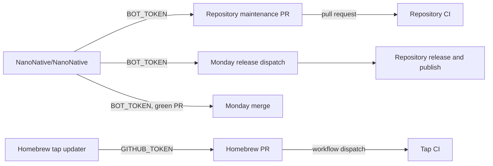

# Automation ownership

`NanoNative/NanoNative` owns organisation-wide scheduling. Its `BOT_TOKEN`
merges green maintenance pull requests and dispatches releases in other
repositories.



| Work | Runs in | Writer | Reason |
| --- | --- | --- | --- |
| Merge green Dependabot and maintenance PRs | `NanoNative/NanoNative` | `BOT_TOKEN` | One authority across the organisation. |
| Dispatch releases | `NanoNative/NanoNative` | `BOT_TOKEN` | Discovery and scheduling are central. |
| Create tags, GitHub releases, packages, and Central coordinates | Source repository | Scoped `GITHUB_TOKEN` | The release owns its artifacts. |
| Update Homebrew casks and formulae | `NanoNative/homebrew-tap` | Its `GITHUB_TOKEN` | The updater and tap are the same repository. |
| Validate a Homebrew PR | `NanoNative/homebrew-tap` | Its `GITHUB_TOKEN` | The updater dispatches formula CI for its exact commit. |

The tap updater runs daily at 20:00 UTC, supports manual dry runs, updates only
declared stable release assets, and opens one `bot/maintenance-homebrew` PR. It
then dispatches `🍺 CI · Formula` for that exact commit. GitHub can mark the
automatic pull-request run created by `GITHUB_TOKEN` as `UNKNOWN` or `UNSTABLE`;
Monday maintenance recognizes the successful explicit formula run before it
merges. The updater does not wait for CI.

The central `BOT_TOKEN` uses its Contents write scope to merge this green
Homebrew PR. It is never used to create Homebrew branches or PRs; the tap has no
secret.

## Homebrew asset contract

Each Cask or formula declares its release and every downloaded asset:

```rb
# nanonative-release: NanoNative/example
# nanonative-release-asset: Example-{version}.zip
```

The tap updater downloads each asset, verifies and writes its SHA-256, runs
`brew style`, and changes nothing when all declarations already match the latest
stable release. The Cask or formula selects operating systems and CPU
architectures with Homebrew's normal conditions.

## Operating rules

- Every scheduled workflow has a manual dry run. A dry run can read, build,
  test, style, and print its intended mutation; it never creates a branch, pull
  request, tag, release, deployment, or package.
- `BOT_TOKEN` belongs only in this repository. Source repositories use their
  scoped action token for their own release work.
- Weekly maintenance runs Monday at 06:00 UTC. It merges non-draft, green
  `dependabot/*` and `bot/maintenance-*` PRs. GitHub can report an automatic
  maintenance PR as `UNKNOWN` or `UNSTABLE`; the scheduler then requires the
  explicit green `build-pr.yml` run for that exact commit before merging.
- Weekly release discovery runs Monday at 16:00 UTC. It dispatches work and
  does not wait for it.
- Exactly one `# nanonative-release: true` workflow marker opt a repository
  into weekly release discovery. Multiple markers skip the repository.
- Exactly one `# nanonative-java-upstream: owner/repository` marker opts a Java
  repository into upstream maintenance. Multiple markers skip it.
- Maven Wrapper updates use a repository-scoped `GITHUB_TOKEN`: the wrapper
  changes source files in that repository. The updater opens a normal
  `bot/maintenance-maven-wrapper` PR only when `mvn wrapper:wrapper` changed
  files.
