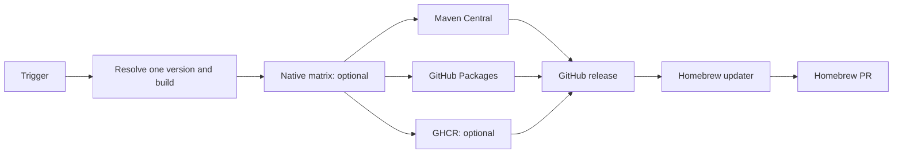

# Java CI/CD

Reusable Java workflows use POSIX `sh`. External workflow calls use a complete
commit SHA; local calls use `./.github/workflows/` from that same source commit.



The build resolves one version, writes it only to the temporary workspace POM,
and tests it. It never uses `project.version` as a release input. A dry run
always resolves a snapshot; Central and GitHub Packages deploy that snapshot.
GitHub releases exist only for a successful non-snapshot version.

## POM baseline

- Use `<version>1.0.0</version>` and define `project.build.outputTimestamp`.
- Group version properties as project, test, then build.
- Set `maven-jar-plugin` `outputTimestamp` from that property; the build
  replaces it with the checked-out commit timestamp.
- Use `maven-compiler-plugin` `<release>`, never `<source>`/`<target>`.
- Attach sources and Javadocs in the normal build. A JAR project publishes its
  POM, JAR, sources JAR, and Javadocs JAR; a POM project publishes only its POM.
- Central uses profile `central`, GPG, and
  `central-publishing-maven-plugin` `0.11.0` with `autoPublish`. A snapshot
  deploys to Central's snapshot endpoint and succeeds when Maven succeeds.
  Maven can return after validating a stable deploy, so the shared publisher
  polls Central's authoritative state for up to five minutes. Only `PUBLISHED`
  succeeds; a tag or GitHub release therefore cannot claim a coordinate that
  Central has merely validated.

## Standard repository workflows

Each Java library has exactly these callers. Replace `<SHA>` with a full commit
SHA from this repository, and omit a publisher the project does not use.

### Pull request

```yml
name: 🧩 CI · Pull Request

on:
  pull_request:
  workflow_dispatch:
    inputs:
      ref:
        description: Ref.
        required: false
        type: string

permissions: {}

jobs:
  build:
    permissions:
      contents: read
      packages: read
    uses: NanoNative/NanoNative/.github/workflows/wc_java_build_common.yml@<SHA>
    with:
      ref: ${{ inputs.ref || github.sha }}
```

### Snapshot on merge

```yml
name: 🧩 CD · Snapshot

on:
  push:
    branches: [main]

permissions: {}

jobs:
  release:
    permissions:
      contents: read
      packages: read
    uses: NanoNative/NanoNative/.github/workflows/wc_java_release.yml@<SHA>
    with:
      semver_strategy: snapshot

  central:
    needs: release
    permissions:
      actions: read
      contents: read
      deployments: write
    uses: NanoNative/NanoNative/.github/workflows/wc_java_publish_central.yml@<SHA>
    secrets: inherit

  packages:
    needs: release
    permissions:
      actions: read
      contents: read
      deployments: write
      packages: write
    uses: NanoNative/NanoNative/.github/workflows/wc_java_publish_github_packages.yml@<SHA>
```

### Stable release

```yml
name: 🏷️ CD · Release

on:
  workflow_dispatch:
    inputs:
      maven_central:
        description: Maven Central.
        required: true
        default: true
        type: boolean
      github_packages:
        description: GitHub Packages.
        required: true
        default: true
        type: boolean
      force:
        description: Force.
        required: true
        default: false
        type: boolean

# nanonative-release: true
permissions: {}

jobs:
  release:
    permissions:
      contents: read
      packages: read
    uses: NanoNative/NanoNative/.github/workflows/wc_java_release.yml@<SHA>
    with:
      force: ${{ inputs.force }}
      dry_run: ${{ inputs.maven_central != true || inputs.github_packages != true }}

  central:
    needs: release
    if: ${{ always() && !cancelled() && inputs.maven_central && needs.release.result == 'success' }}
    permissions:
      actions: read
      contents: read
      deployments: write
    uses: NanoNative/NanoNative/.github/workflows/wc_java_publish_central.yml@<SHA>
    secrets: inherit

  packages:
    needs: release
    if: ${{ always() && !cancelled() && inputs.github_packages && needs.release.result == 'success' }}
    permissions:
      actions: read
      contents: read
      deployments: write
      packages: write
    uses: NanoNative/NanoNative/.github/workflows/wc_java_publish_github_packages.yml@<SHA>

  github:
    needs: [release, central, packages]
    if: ${{ always() && !cancelled() && needs.release.outputs.dry_run == 'false' && !endsWith(needs.release.outputs.version, '-SNAPSHOT') && needs.release.result == 'success' && needs.central.result == 'success' && needs.packages.result == 'success' }}
    permissions:
      actions: read
      contents: write
    uses: NanoNative/NanoNative/.github/workflows/wc_java_create_github_release.yml@<SHA>
    with:
      commit_sha: ${{ needs.release.outputs.commit_sha }}
      version: ${{ needs.release.outputs.version }}
```

`maven_central` and `github_packages` default to true. Turning either off
converts the entire run to a snapshot, rather than pretending a partial stable
release is safe. The publishers run in parallel. GitHub release waits for all
enabled publishers.

### Maintenance

```yml
name: 🛠️ CI · Maintenance

on:
  schedule:
    - cron: '0 6 * * 0'
  workflow_dispatch:
    inputs:
      dry_run:
        description: Dry run.
        required: true
        default: true
        type: boolean

permissions: {}

jobs:
  maven_wrapper:
    permissions:
      actions: write
      contents: write
      pull-requests: write
    uses: NanoNative/NanoNative/.github/workflows/wc_java_update_maven_wrapper.yml@<SHA>
    with:
      dry_run: ${{ github.event_name == 'workflow_dispatch' && inputs.dry_run || false }}
```

Dependabot handles Maven dependencies and actions. Maven Wrapper is separate:
Dependabot does not own its files, so the maintenance job uses the current
GitHub runner Maven to update it and opens `bot/maintenance-maven-wrapper`
only when files actually changed.

## Versioning

| Condition | Version |
| --- | --- |
| Normal Java release | UTC date: `YYYY.M.D` |
| `snapshot`, `rc`, `major`, `minor`, `patch` strategy | Matching `next_<strategy>` output of `semver-info-action` |
| Upstream newer than latest local tag without a strategy | Exact upstream version |
| Dry run, non-default branch, or no production changes | `next_snapshot` |

The Semver base is the latest tag by tag creation time or the upstream version.
With no tag, it is `0.0.1`. Date versions have no leading zero, so Semver tools
accept them. An upstream release is read from its public GitHub release; the
caller sets `upstream_repository` and normally uses `semver_strategy: snapshot`.
An explicit strategy always wins; only a strategy-free upstream release uses its
exact version.

## Native and Docker

Native projects add `native` after `release`; Central, Packages, and Docker all
wait for it. Native artifacts are release assets retained one day for snapshots
and attached permanently for a stable GitHub release.

| Asset | Runner | Build route | Reason |
| --- | --- | --- | --- |
| Linux AMD64 | `ubuntu-latest` | `Dockerfile_Native` | Standard Linux target. |
| Linux ARM64 | `ubuntu-24.04-arm` | `Dockerfile_Native` | Native ARM runner; no QEMU. |
| macOS Intel | `macos-15-intel` | Maven `-Pnative` | Intel Macs. |
| macOS Apple Silicon | `macos-latest` | Maven `-Pnative` | Apple Silicon Macs. |
| Windows x64 | `windows-latest` | Maven `-Pnative` + MSVC | Windows target. |

`fail-fast: false` reports every platform. Buildx assembles the Linux image
from native AMD64 and ARM64 assets; it does not emulate or compile them again.
There is no Windows ARM64 asset because it has no current release requirement.

Docker projects call `wc_java_publish_docker.yml` after `release` and `native`.
It publishes `ghcr.io/<owner>/<repository>:<version>`; a stable release also
updates `latest`. Pre-releases and snapshots never move `latest`.

## Homebrew

Homebrew watches public stable GitHub releases. The source project and the tap
need no Homebrew token. A formula or Cask declares its source and assets:

```rb
# nanonative-release: NanoNative/my-tool
# nanonative-release-asset: my-tool-macos-arm64-{version}.native
url "..."
sha256 "..."
```

The tap selects macOS/Linux and CPU targets with normal Homebrew conditions.
Its daily updater downloads assets, writes SHA-256 values, styles changed files,
and opens one `bot/maintenance-homebrew` pull request. Central weekly
maintenance merges it only after the explicit formula CI passed.

## Migration proof

1. Make one CI-only pull request: POM baseline, standard callers, Dependabot,
   and the matching full SHA.
2. Verify the pull-request build, squash merge, and inspect the real snapshot
   publication to Central and GitHub Packages.
3. Dispatch one forced stable release when appropriate. Verify Central,
   Packages, tag, GitHub Release, POM/JAR/sources/Javadocs, and each enabled
   native asset or image.
4. Delete the old workflows and obsolete `version.txt` only after that proof.

External-process tests must use dynamic ports unless a configured port is the
test subject, and must clean up every child process. A maintenance runner is
shared; leaving a server behind is not a charming shortcut.
